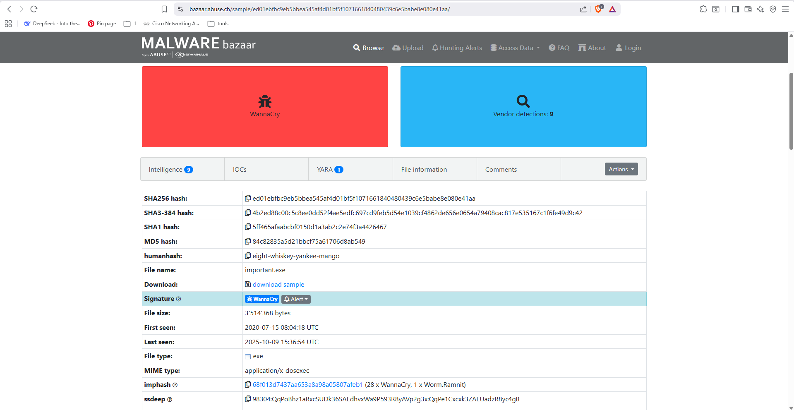
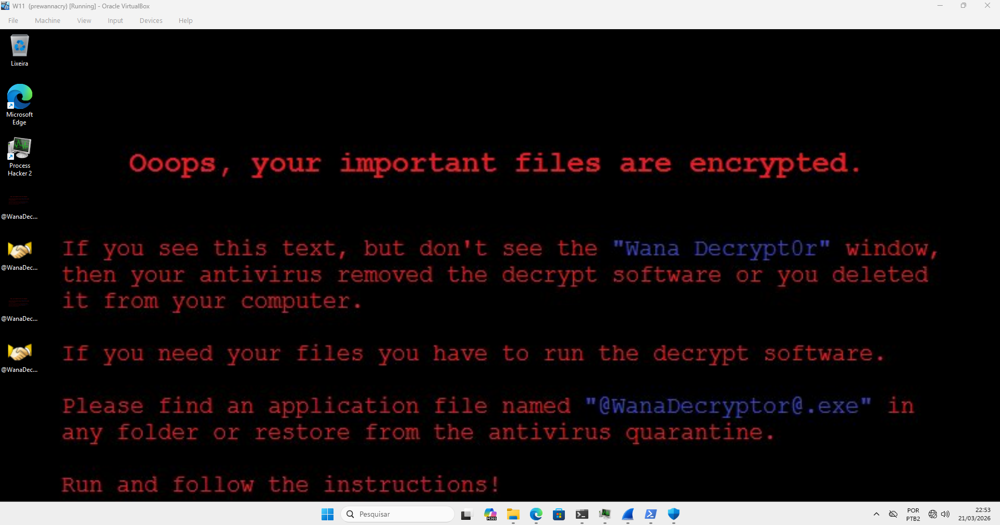
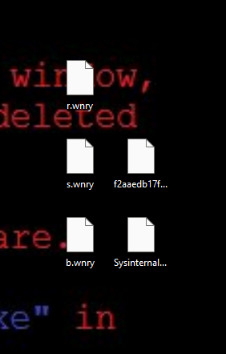
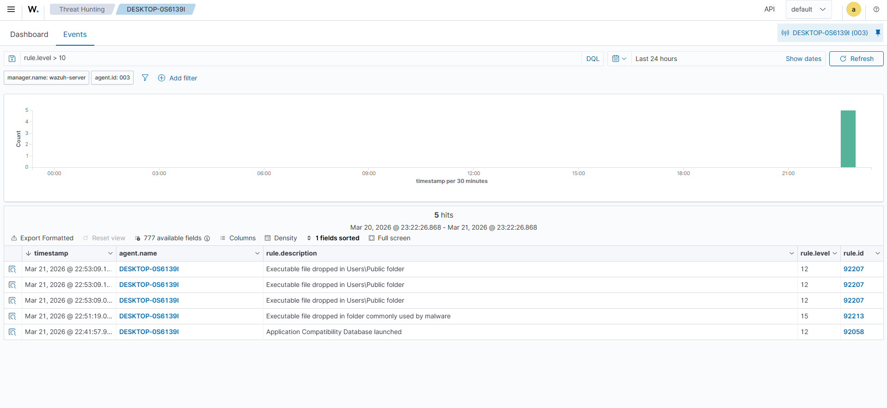
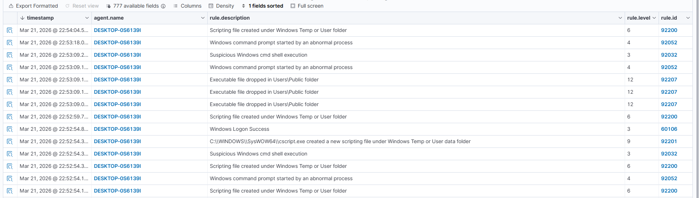
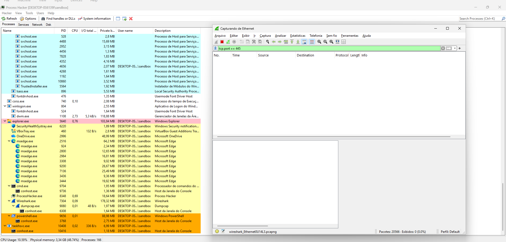

# Ransomware Analysis & Detection Lab: WannaCry 🛡️☣️

> [!WARNING]
> **AVISO DE SEGURANÇA:** Este laboratório envolve a execução de malware real (WannaCry) em um ambiente controlado e isolado (Sandbox). **Não execute esses artefatos em redes domésticas ou corporativas.** O autor não se responsabiliza por danos causados pelo uso indevido das informações aqui contidas.

## 🎯 Objetivo Geral
Este projeto documenta a análise dinâmica e o monitoramento de segurança do ransomware **WannaCry**. O foco principal foi validar a eficácia do **Wazuh SIEM** em conjunto com o **Sysmon** para detectar as táticas de criptografia, persistência e inibição de recuperação de dados, garantindo visibilidade total mesmo após a desativação proposital de defesas tradicionais (Microsoft Defender).

---

## 📚 Aprendizado e Ferramental Técnico
A execução deste lab permitiu compreender como um "Worm-Ransomware" se comporta após a infecção inicial e como os logs de telemetria de endpoint são cruciais para a resposta a incidentes.

### 🛠️ Ferramental Utilizado
* **Wazuh SIEM:** Centralização, correlação de eventos e geração de alertas críticos.
* **Sysmon (System Monitor):** Coleta de telemetria detalhada de processos e arquivos (Event IDs 1 e 11).
* **Process Hacker 2:** Monitoramento da árvore de processos e identificação de artefatos em execução.
* **MalwareBazaar:** Fonte de obtenção da amostra real (SHA256: `ed01ebfbc9eb5bbea545af4d01bf5f1071661840480439c6e5babe8e080e41aa`).

---

## 🚀 1. Preparação e Isolamento (Blue Team)
O ambiente foi rigorosamente isolado para evitar vazamentos de tráfego malicioso.

*Figura 1: Identificação e coleta da amostra "important.exe" (WannaCry) via MalwareBazaar.*

* **Sandboxing:** Máquina Windows 11 configurada em rede **Host-only** no VirtualBox.
* **Snapshot Strategy:** Ponto de restauração criado antes da execução para permitir o rollback do sistema criptografado.
* **Defense Evasion (Simulada):** Desativação do Defender via PowerShell para analisar o comportamento "puro" do ransomware sem bloqueios preventivos.

---

## ⚔️ 2. Execução e Impacto (Red Team)

### Detonação e Criptografia
Após a execução do artefato, o malware iniciou o processo de sequestro de dados e exibição da nota de resgate.

*Figura 2: Execução bem-sucedida do @WanaDecryptor@.exe e exibição da tela de resgate.*

*Figura 3: Impacto direto no sistema de arquivos: documentos sequestrados e renomeados com a extensão .wncry.*

---

## 🛡️ 3. Detecção e Monitoramento (Blue Team)

### Visibilidade no SIEM (Wazuh)
Mesmo com o antivírus desativado, o Wazuh capturou as atividades suspeitas por meio das regras de correlação do Sysmon.

*Figura 4: Dashboard do Wazuh exibindo alertas de Nível 12 e 15 (Crítico) durante a infecção.*

*Figura 5: Agrupamento de alertas detectando a criação de executáveis em pastas públicas e execução de comandos anormais.*

### Análise Dinâmica de Processos
Utilização de ferramentas de análise para identificar a persistência e a tentativa de movimentação lateral.

*Figura 6: Monitoramento de processos ativos e análise de conexões de rede (SMB/445) via Process Hacker e Wireshark.*

---

## 🛠️ 4. Troubleshooting e Observações Técnicas

* **Técnica de Self-Deletion:** Observou-se que o executável original se autoexcluiu logo após a infecção primária. Isso reforça a importância de logs de telemetria em tempo real, já que o artefato físico pode desaparecer durante a análise forense.
* **Inibição de Recuperação:** Foi detectado o uso do `vssadmin` para deletar **Shadow Copies**, impedindo que o usuário restaurasse o sistema para um estado anterior à criptografia.
* **Falsos-Positivos:** Durante o lab, alertas de nível 15 foram gerados por scripts de política do PowerShell (`__PSScriptPolicyTest`). Esse comportamento foi mapeado como ruído benigno gerado pela própria preparação do ambiente.

---

## 🎯 Mapeamento MITRE ATT&CK
* **T1105:** Ingress Tool Transfer (Download do artefato).
* **T1486:** Data Encrypted for Impact (Criptografia dos dados).
* **T1490:** Inhibit System Recovery (Deleção de backups/Shadow Copies).
* **T1070.004:** Indicator Removal on Host: File Deletion (Self-deletion do malware).

---

📄 *Este projeto faz parte do meu portfólio de estudos em Cibersegurança e SOC.*
